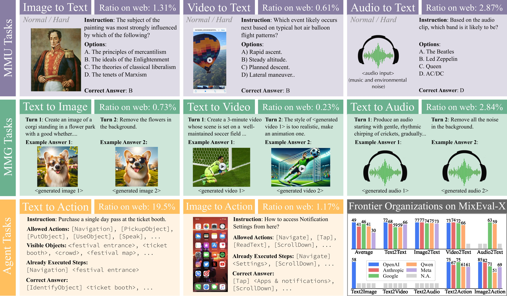

<p align="center" width="100%">

</p>
<p align="center"><a href="https://mixeval-x.github.io/">🚀 Project Page</a> | <a href="https://huggingface.co/datasets/MixEval/MixEval-X">🤗 HF Dataset</a> | <a href="https://arxiv.org/abs/2410.13754">📜 arXiv</a> | <a href="https://mixeval-x.github.io/#leaderboard">🏆 Leaderboard</a> | <a href="https://beneficial-chips-08e.notion.site/Don-t-Build-Random-Evals-Principles-for-General-Purpose-Model-Evaluation-bd5a85ba10f447bc9ac560050f67270b">📝 blog</a> | <a href="https://huggingface.co/papers/2410.13754">🤗 HF Paper</a> | <a href="https://x.com/NiJinjie/status/1848053078978957707">𝕏 Twitter</a></p>
</p>

---
[](https://x.com/NiJinjie)

<a href="https://hits.seeyoufarm.com"></a>


<br>
<p align="center" width="100%">

</p>

*MixEval-X encompasses eight input-output modality combinations and can be further extended. Its data points reflect real-world task distributions. The last grid presents the scores of frontier organizations’ flagship models on MixEval-X, normalized to a 0-100 scale, with MMG tasks using win rates instead of Elo. Section C of the paper presents example data samples and model responses.*

<br>

# ⚡ News

[2024-12-10] [LMMs-Eval](https://github.com/EvolvingLMMs-Lab/lmms-eval/tree/main) now supports running model evaluations of MixEval-X. You can run MixEval-X MMU tasks for your own models with one command at [here](https://github.com/EvolvingLMMs-Lab/lmms-eval/tree/main/lmms_eval/tasks/mix_evals)! 

[2024-10-20] MixEval-X is released! Checkout the Paper and Leaderboard to learn more about this real-world any-to-any benchmark!🌟

<br>

# MixEval-X

**MixEval-X** is the **first** any-to-any, real-world benchmark featuring **diverse input-output modalities**, **real-world task distributions**, **consistent high standards across modalities**, and **dynamism**. It achieves up to **0.98** correlation with arena-like multi-modal evaluations while being way more efficient.

> See the [project page](https://mixeval-x.github.io/) and [paper](https://arxiv.org/abs/2410.13754) for more details.

<br>

# This Repo
This repo contains the grading code for MixEval-X. Once you have prepared your model outputs according to the required format, you will be able to get the final scores in just a few steps.

The MixEval-X data can be downloaded from the [huggingface](https://huggingface.co/datasets/MixEval/MixEval-X).

**Feel free to use your own grading code, as long as it's fair.**

<br>

# Quick Start
**(Step 1)** Clone repo and setup the environment:
```
git clone https://github.com/Psycoy/MixEval-X.git
cd MixEval-X
conda create -n MixEval-X python=3.11 --yes
conda activate MixEval-X
bash setup.sh

# setup done
```

**(Step 2)** Setup the OpenAI API key for model parser. Create `.env` file under root dir (`MixEval-X/`) and add the below line to it:
```
MODEL_PARSER_API=<your openai api key>
```
> The values in [Leaderboard](https://mixeval-x.github.io/#leaderboard) use `GPT-3.5-Turbo-0125` as the default model parser for MMU tasks, `gpt-4o-2024-08-06` as the default model parser for agent tasks. 


**(Step 3)** Prepare the model outputs as specified [here](docs/model_output_formats.md) on your own side, and use the below command to compute the results. That's all!

Image2Text
```
# Normal Version
python -m mixeval_x.compute_metrics_mmu \
    --benchmark image2text \
    --model_response_dir THE_PATH_TO_MODEL_OUTPUT_FOLDER \
    --models_to_eval \
        gemini_1_5_pro \
        gemini_1_5_flash

# Hard Version
python -m mixeval_x.compute_metrics_mmu \
    --benchmark image2text_hard \
    --model_response_dir THE_PATH_TO_MODEL_OUTPUT_FOLDER \
    --models_to_eval \
        gemini_1_5_pro \
        gemini_1_5_flash
```

Video2Text
```
# Normal Version
python -m mixeval_x.compute_metrics_mmu \
    --benchmark video2text \
    --model_response_dir THE_PATH_TO_MODEL_OUTPUT_FOLDER \
    --models_to_eval \
        gemini_1_5_pro \
        gemini_1_5_flash

# Hard Version
python -m mixeval_x.compute_metrics_mmu \
    --benchmark video2text_hard \
    --model_response_dir THE_PATH_TO_MODEL_OUTPUT_FOLDER \
    --models_to_eval \
        gemini_1_5_pro \
        gemini_1_5_flash
```

Audio2Text
```
# Normal Version
python -m mixeval_x.compute_metrics_mmu \
    --benchmark audio2text \
    --model_response_dir THE_PATH_TO_MODEL_OUTPUT_FOLDER \
    --models_to_eval \
        gemini_1_5_pro \
        gemini_1_5_flash

# Hard Version
python -m mixeval_x.compute_metrics_mmu \
    --benchmark audio2text_hard \
    --model_response_dir THE_PATH_TO_MODEL_OUTPUT_FOLDER \
    --models_to_eval \
        gemini_1_5_pro \
        gemini_1_5_flash
```

Text2Action
```
python -m mixeval_x.compute_metrics_mmg_agent \
    --benchmark text2action \
    --model_response_dir THE_PATH_TO_MODEL_OUTPUT_FOLDER \
    --judge_model "gpt-4o-2024-08-06" \
    --models_to_eval \
        gemini_1_5_pro \
        gemini_1_5_flash
```

Image2Action
```
python -m mixeval_x.compute_metrics_mmg_agent \
    --benchmark image2action \
    --judge_model "gpt-4o-2024-08-06" \
    --model_response_dir THE_PATH_TO_MODEL_OUTPUT_FOLDER \
    --image2action_image_dir THE_PATH_TO_IMAGE2ACTION_INPUT_IMAGES \
    --models_to_eval \
        gemini_1_5_pro \
        gemini_1_5_flash
```

Text2Image
```
python -m mixeval_x.compute_metrics_mmg_agent \
    --benchmark text2image \
    --judge_model "gpt-4o-2024-08-06" \
    --model_response_dir THE_PATH_TO_MODEL_OUTPUT_FOLDER \
    --models_to_eval \
        gemini_1_5_pro \
        gemini_1_5_flash
```

> The MMG results (Text2Image, Text2Video, and Text2Audio) in [Leaderboard](https://mixeval-x.github.io/#leaderboard) were graded with Amazon Mechanical Turk workers. Text2Image also supports model parsing (See Section 4.2 of the paper). However, the Text2Video and Text2Audio lack capable model judges, and thus their grading are not implemented. **You should hire human evaluators to grade these two subsets.**

<br>

# Why to Use MixEval-X Benchmarks?

🥇 It extends all the benefits of MixEval to multi-modal evaluations, including comprehensive and less biased query distribution; fair grading (except open-ended tasks); dynamism; accurate model ranking; fast, cost-effective, reproducible execution; and challenging nature.

🥇 It establishes unified, high standards across modalities and communities. For single-modality models, it ensures its evaluation keeps up with the state-of-the-art standards; for multi-modality models, it ensures consistent, high-standard evaluations across modalities, preventing any from becoming a bottleneck.

🥇 Beyond model evaluation, MixEval-X benchmarks different organizations (as shown in the first Figure) with balanced dimensions (modalities), unlocking a new level of evaluation.

<br>

# Acknowledgement

We thank Graham Neubig, Yuntian Deng, Jason Phang, Piotr Nawrot, Luca Soldaini, Guanzhi Wang, Qinghong Lin for insightful discussions and pointers; we thank Fanyi Pu for his great effort in integrating the evaluation protocols.

<br>

# 🦾 Contribute

Feel free to hit the ⭐**star** button or 🦾**contribute**! We review new issues and PRs regularly and will acknowledge your contributions!

<br>

# 📑 Citation

If you found this repository useful, please consider 📑**citing**:

```
@article{ni2024mixevalx,
        title={MixEval-X: Any-to-Any Evaluations from Real-World Data Mixtures},
        author={Ni, Jinjie and Song, Yifan and Ghosal, Deepanway and Li, Bo and Zhang, David Junhao and Yue, Xiang and Xue, Fuzhao and Zheng, Zian and Zhang, Kaichen and Shah, Mahir and Jain, Kabir and You, Yang and Shieh, Michael},
        journal={arXiv preprint arXiv:2410.13754},
        year={2024}
        }

@article{ni2024mixeval,
        title={MixEval: Deriving Wisdom of the Crowd from LLM Benchmark Mixtures},
        author={Ni, Jinjie and Xue, Fuzhao and Yue, Xiang and Deng, Yuntian and Shah, Mahir and Jain, Kabir and Neubig, Graham and You, Yang},
        journal={arXiv preprint arXiv:2406.06565},
        year={2024}
        }
```